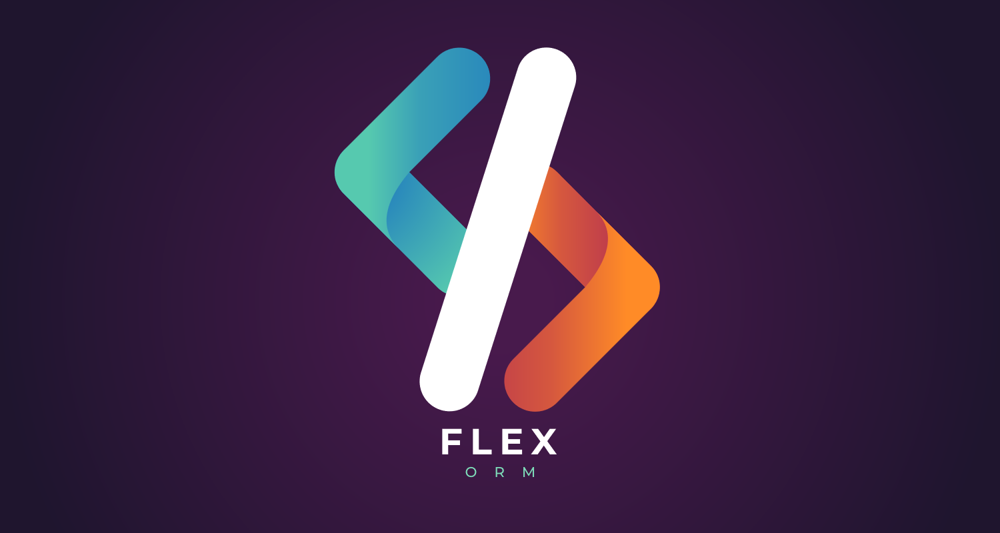

<p align="center">
  
</p>


# Flex 

Flex is a lightweight object-relational mapping (ORM) product for the Microsoft .NET Core and SQL : it provides a framework for mapping an object-oriented domain model to a traditional SQL database. Written in **C# .NET Core 3.1** using active record pattern. Flex currently supports **MySQL** and **SQLite** (Postgre soon)

> Flex uses precompiled lambdas expressions for resource intensive reflexive tasks. Like entity instantiation or access to the property of the entity

[](https://www.nuget.org/packages/Flex/)


## Schema Mapping

```csharp

  [Table("Users")]
  public class User : IEntity 
  { 
      [Primary(GenerationType.AutoIncrement)] 
      public int Id
      {
          get;
          set;
      }

      public string Name
      {
          get;
          set;
      }

      [Update]
      public string Ip
      {
          get;
          set;
      }

      [Binary] // <--- Fast serialization using Google Protobuf 
      public Certificate Certificate 
      {
          get;
          set;
      }

      [Transient]  // <--- This property is ignored in SQL Schema 
      public bool Connected
      {
          get;
          set;
      }
  }
```
 * Mapping attributes

  | Name        | Description           | Status
| ------------- |:-------------:|:-------------:|
| **Binary**      | Indicates that the field must be serialized in binary (anything that is not a primitive type and a collection) | ✅
| **Foreign** | Indicates that the concerned object is a foreign key of another table | ❌
| **NotNull** | Indicates that the property cannot have the value DbNull| ✅
| **Primary** | Indicates that the property is a primary key | ✅
| **Transient** | Indicates that the property will be ignored by the mapping | ✅


 ## Interopability

```csharp

  Database database = new Database(new MySqlProvider("myDb","localhost","root",""));
  // or
  Database database =  new Database(new SQLiteProvider("file.sqlite"));

```

 ## Reading database

* Flex allows the creation of dynamic queries using **System.Linq**.

```csharp

  Table<User> table = database.GetTable<User>();

  long count = table.Count();

  IEnumerable<User> Users = table.Select();

  IEnumerable<User> users = table.Select(x=> x.Username == "John Doe").GroupBy(x => x.Ip); // <--- Dynamic query builder

```

 ## Writting database

```csharp

  User user = new User();
  user.Name = "John Doe";
  user.Certificate = new Certificate();

  table.Insert(user);

  user.Ip = "127.0.0.1";

  table.Update(user);

  table.DeleteAll();

  database.Drop<User>();

```

 ## Query Scheduler

* Schedulers can be used to reduce the number of transactions made to the database. Schedulers are thread safe. It is also possible to perform cyclic synchronization.

```csharp

table.Scheduler.InsertLater(new User() { Name : "John" });
table.Scheduler.InsertLater(new User() { Name : "Ethan" });
table.Scheduler.InsertLater(new User() { Name : "William" });

table.Scheduler.Apply(); // <--- Only one query is executed.

```

 ## Database Copy (from one SGBD to another)

```csharp

  Database mySqlDb = new MySqlDatabase("MyDatabase","localhost","root","");
  Database sqlLiteDb = new SQLiteDatabase("database.sqlite");

  sqlLiteDb.CopyTo(mySqlDb);

```

# Package Dependencies

 | Name        | Version           |
| ------------- |:-------------:|
| MySql.Data      | 8.0.26 | 
| protobuf-net | 3.0.101 |
| System.Data.SQLite | 1.0.115 | 


